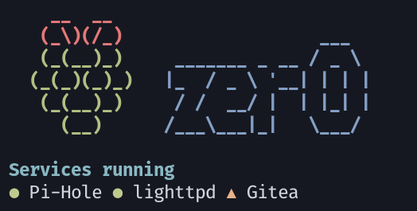

1. Debian 10 (buster)
2. [Pi-hole](https://github.com/pi-hole/pi-hole) 
3. [Sonarr](https://github.com/Sonarr/Sonarr), [Radarr](https://github.com/Radarr/Radarr), [Lidarr](https://github.com/lidarr/Lidarr) with Deluge as torrent backend.
4. Minecraft server
